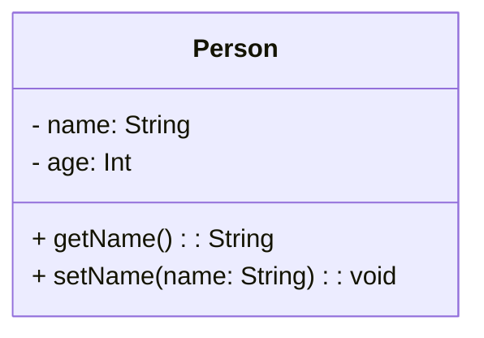
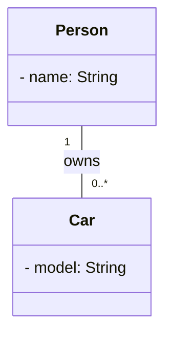
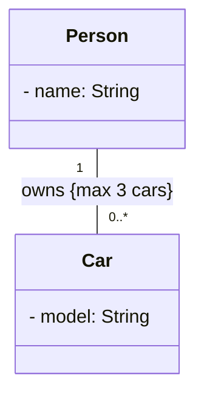
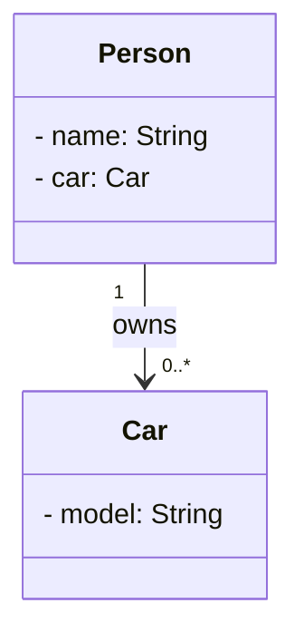
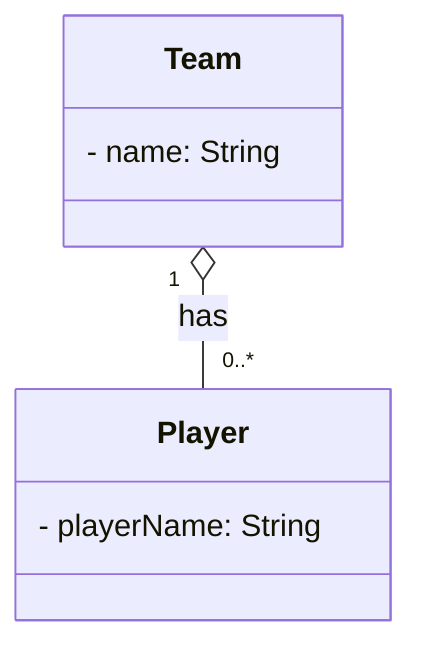
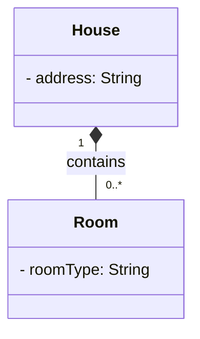
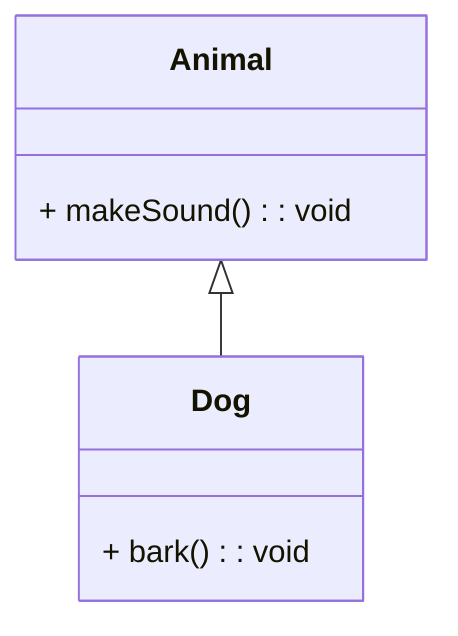
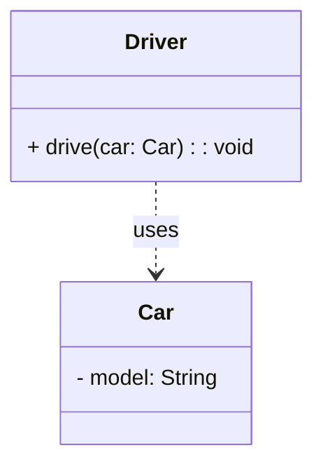

# In-Class Notes

## Modeling

Why use modeling? It can help comprehension of complex code bases, and be used to communicate design to others effectively, including those with less technical backgrounds.

UML Diagrams fit into 2 main categories: **structural** and **behavioral**.

### UML Class Diagrams

Class diagrams are structural UML diagrams.

A class is represented as a rectangle with 3 compartments:
1. Class name
2. Attributes (fields, properties)
3. Methods (functions)

Objects, or instances of classes, are represented just like classes, but with the object name underlined. The practicality of objects in class diagrams is debated.

Associations can be thought of as declarative sentences about the relationship between classes. They are represented with lines connecting them.

Associations can have multiplicity, which indicates how many instances of one class relate to instances of another class. Common multiplicities include:
- 1 (exactly one)
- 0..1 (zero or one)
- \* (many)
- 1..* (one or more)
- 0..* (zero or more)

While not required, it is common to label associations with role names to clarify the nature of the relationship.

Associations can also have constraints, which are conditions that must hold true for the association. Constraints are typically written in curly braces {} near the association line.

Associations can be directional, indicated by an arrowhead on the association line, clarifying the direction of the relationship. This usually specifies what can be accessed from where in the source code.

#### Aggregation and Composition

Aggregation and composition are special types of associations that represent whole-part relationships.

Aggregation is a "has-a" relationship where the part can exist independently of the whole. It is represented by a hollow diamond at the "whole" end of the association.

This diagram can be read as "A Team has zero or more Players."

Composition is a stronger "part-of" relationship where the part cannot exist independently of the whole. It is represented by a filled diamond at the "whole" end of the association.

This diagram can be read as "A House contains zero or more Rooms."

#### Generalization and Specialization

Generalization and specialization represent inheritance relationships between classes. As opposed to aggregation and composition, which are "has-a" relationships, generalization and specialization are "is-a" relationships.

Generalization is represented by a solid line with a hollow triangle pointing to the superclass.

In this example, Dog is a subclass of Animal, meaning Dog "is-a" Animal. Animal is a generalization of Dog.

Specialization is the inverse of generalization, where a subclass inherits from a superclass. It is represented the same way, with a solid line and hollow triangle pointing to the superclass.

In the above example, Dog is a specialization or subtype of Animal.

#### Dependencies

Dependencies represent a "uses-a" relationship where one class depends on another. It is represented by a dashed line with an open arrowhead pointing to the class being depended upon.

In this example, Driver depends on Car, meaning Driver "uses-a" Car.

#### Association Classes

This is a more esoteric topic, but association classes are classes that are associated with a relationship between two other classes. They are used to model relationships that have attributes or behaviors of their own.

An example is modeling a "Husband" and "Wife" relationship, with a "Marriage" association class that has attributes like "anniversaryDate".

There are also n-ary associations, which involve more than two classes. These can also be modeled with association classes. They are awkward to represent in UML, so are rarely used.

### UML Sequence Diagrams

Sequence diagrams are behavioral UML diagrams that model the interactions between objects over time.

They include:
- **Lifelines**: Represent objects or participants in the interaction, depicted as vertical dashed lines.
- **Messages**: Represent communication between lifelines, depicted as horizontal arrows.
- **Activation Bars**: Represent the period an object is active or executing a process, depicted as thin rectangles on the lifeline.