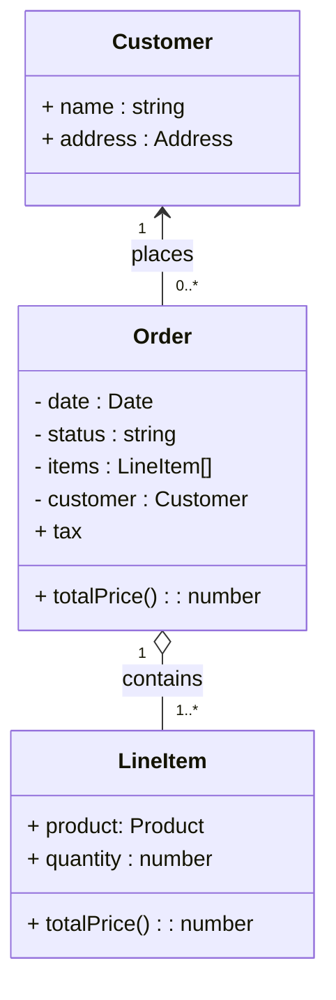

# UML Practice

## Class Diagrams

# Order class

```mermaid
classDiagram
    class Order {
      - date : Date
      - status : string
      - items : LineItem[]
      - customer : Customer
      + totalPrice(): number
      + tax
    }

    class Customer {
      + name : string
      + address : Address
    }

    class LineItem {
      + product: Product
      + quantity : number
      + totalPrice() : number
    }

    Customer "1" <-- "0..*" Order : places
    Order "1" o-- "1..*" LineItem : contains
```